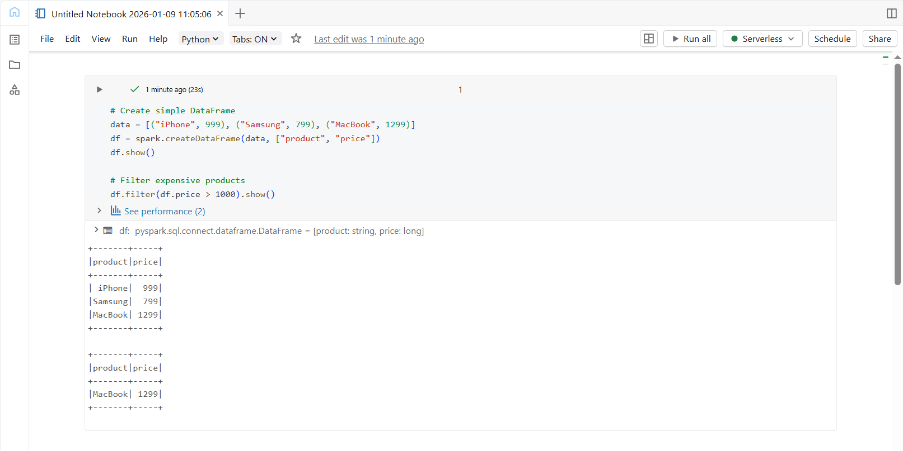

## Day 1 – Platform Setup & First Steps

### Learn
- Why Databricks is preferred over Pandas and Hadoop for big data
- Basics of Lakehouse architecture
- Databricks workspace structure
- Industry use cases (Netflix, Shell, Comcast)

### Tasks
- Created Databricks Community Edition account
- Explored Workspace, Compute, and Data Explorer
- Created first Databricks notebook
- Ran basic PySpark commands

### Practice
- Created a simple Spark DataFrame
- Filtered products with price greater than 1000 using PySpark

### Output Screenshot

### Key Takeaway
Databricks with Apache Spark makes it easier to process and analyze large datasets efficiently.

---

### Acknowledgement
This work is part of the **Databricks 14 Days AI Challenge**,  
organised by [Indian Data Club](https://indiandataclub.com/) and  
[Codebasics](https://codebasics.io/),  
and sponsored by [Databricks](https://www.databricks.com/).

**#DatabricksWithIDC**
