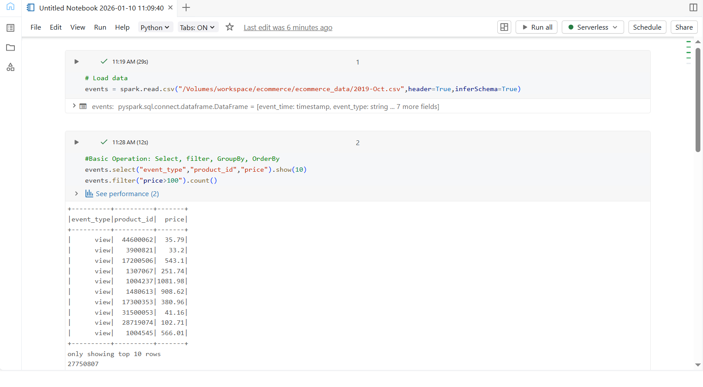
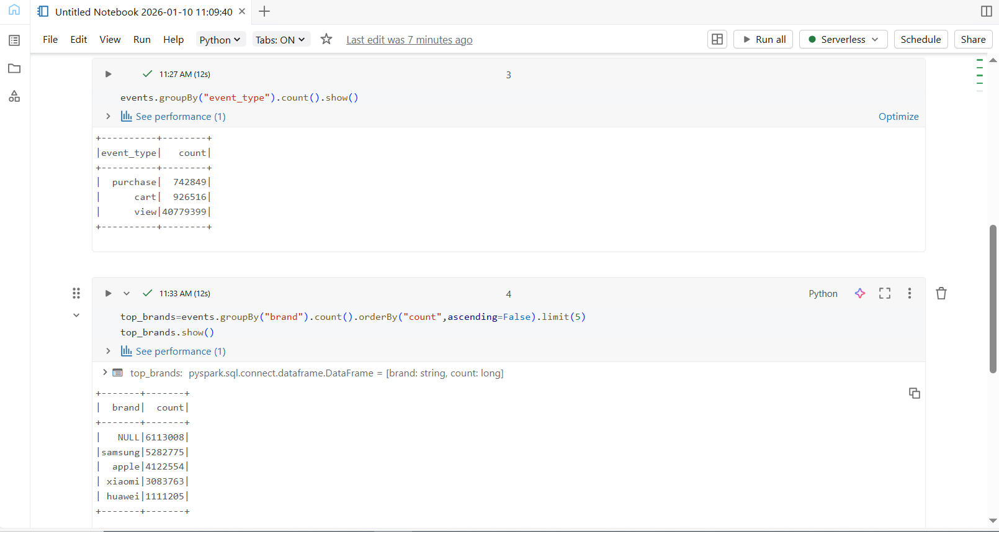

## Day 2 – Apache Spark Fundamentals

### Learn
- Apache Spark architecture (Driver and Executors)
- Difference between DataFrames and RDDs
- Lazy evaluation in Spark
- Basic notebook magic commands in Databricks

### Tasks
- Loaded e-commerce CSV dataset into Databricks
- Read data into a Spark DataFrame
- Performed basic DataFrame operations:
  - select
  - filter
  - groupBy
  - orderBy
- Identified top brands based on event count

### Practice
- Selected relevant columns such as event_type, product_id, and price
- Filtered records where price is greater than 100
- Counted events by event type
- Found top 5 brands using aggregation and sorting

### Output Screenshot
  

### Key Takeaway
Apache Spark uses lazy evaluation, where transformations are executed only when an action is triggered, making large-scale data processing efficient.

---

### Acknowledgement
This work is part of the **Databricks 14 Days AI Challenge**,  
organised by [Indian Data Club](https://indiandataclub.com/) and  
[Codebasics](https://codebasics.io/),  
and sponsored by [Databricks](https://www.databricks.com/).

**#DatabricksWithIDC**
