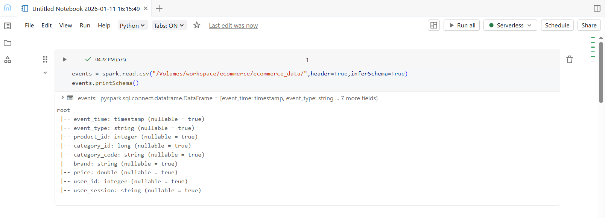
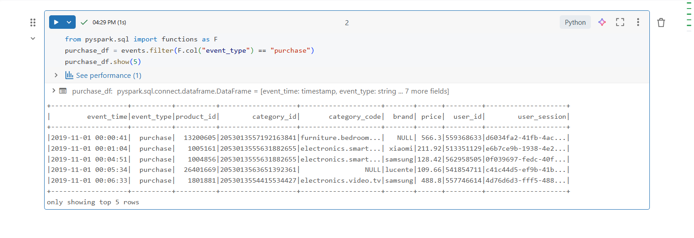
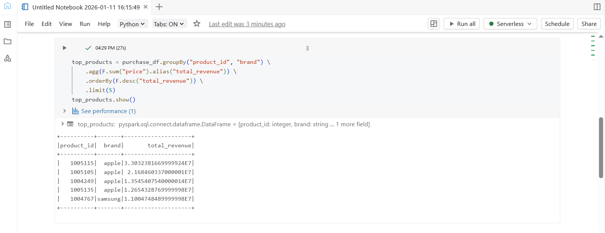
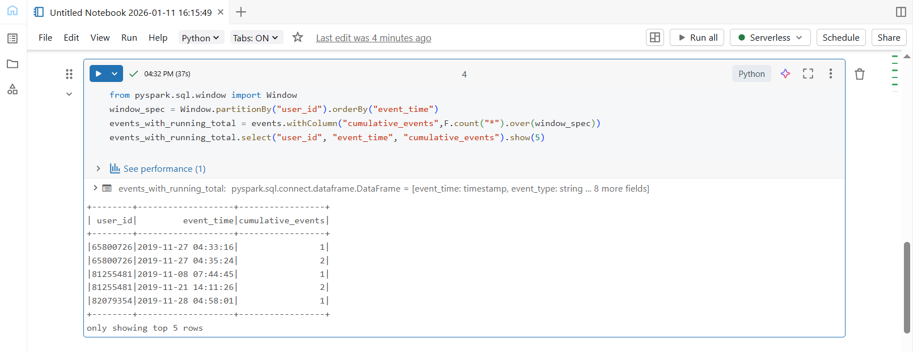
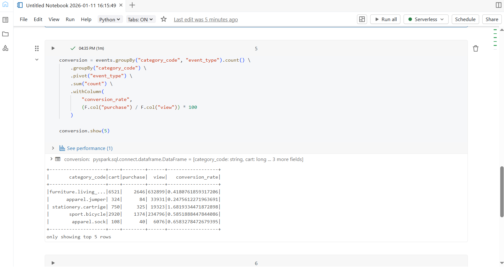

## Day 3 – PySpark Transformations Deep Dive

### Learn
- PySpark vs Pandas comparison
- Joins (inner, left, right, outer)
- Window functions (running totals, rankings)
- User-Defined Functions (UDFs)
 
---

### Tasks
- Load full e-commerce dataset
- Perform complex joins
- Calculate running totals with window functions
- Create derived features

---

### Practice
- Read CSV files into Spark DataFrame from Databricks Volumes
- Used filter, groupBy, agg, and orderBy operations
- Applied Window.partitionBy() for cumulative calculations
- Used pivot() to transform event types into columns
- Created derived column for conversion rate

---

### Output Screenshots

**Load E-commerce Dataset & Schema**  

**Filter Only Purchase Events**  

**Top 5 Products by Revenue**  

**Running Total of Events per User (Window Function)**  

**Conversion Rate by Category**  

---

### Key Takeaway
PySpark transformations make it easy to analyze large datasets using powerful operations like window functions, aggregations, and derived metrics that are not practical with traditional tools.

---

### Acknowledgement
This work is part of the **Databricks 14 Days AI Challenge**,  
organised by [Indian Data Club](https://indiandataclub.com/) and  
[Codebasics](https://codebasics.io/),  
and sponsored by [Databricks](https://www.databricks.com/).

**#DatabricksWithIDC**
