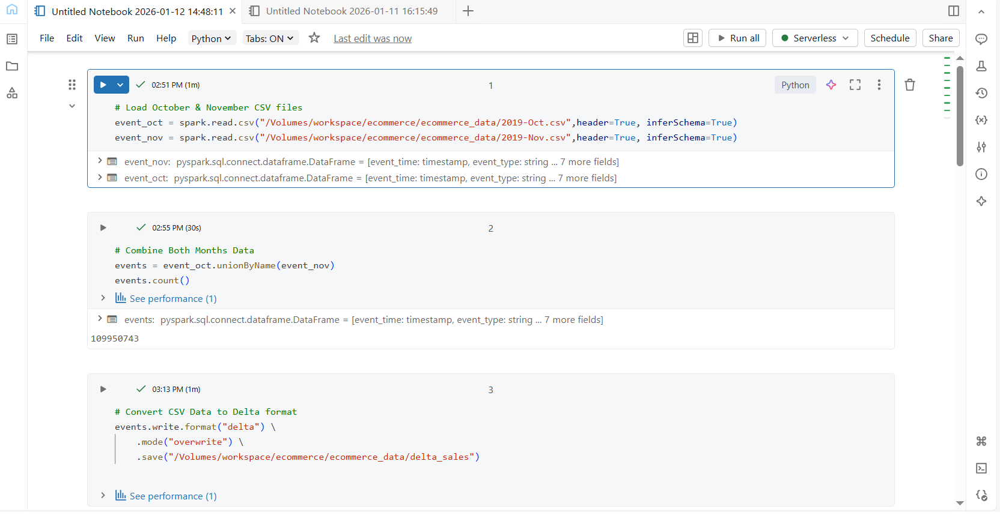
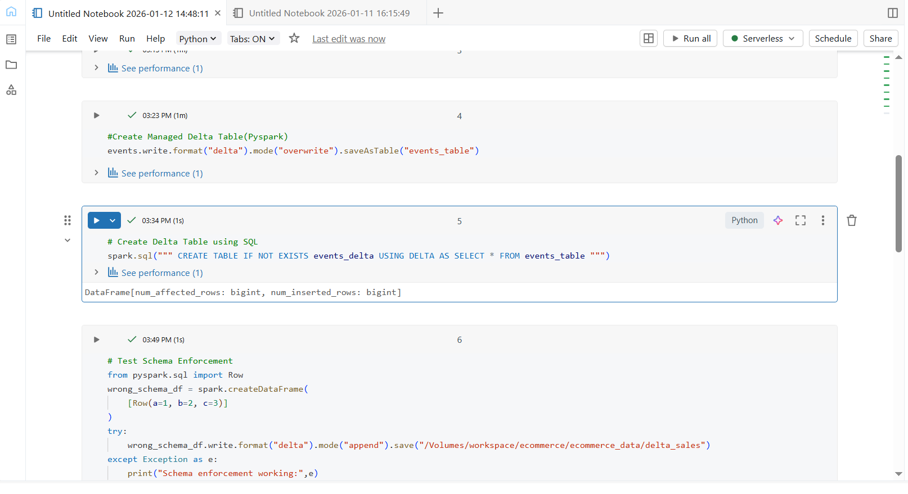
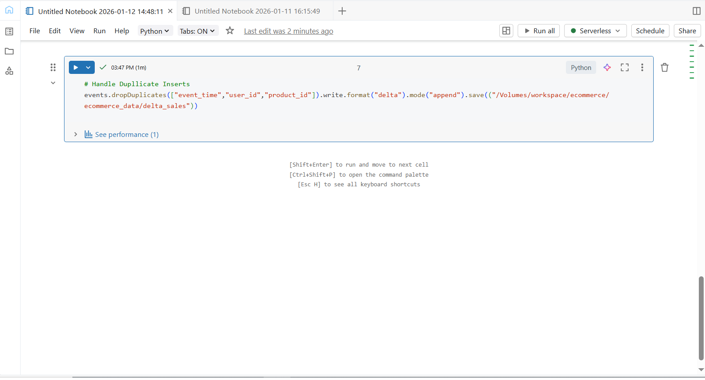

## Day 4 – Delta Lake Fundamentals

### Learn
- What is Delta Lake and why it is used in Databricks
- Difference between Delta Lake and Parquet format
- ACID transactions in Delta Lake
- Schema enforcement and data reliability

### Tasks
- Loaded large e-commerce CSV datasets into Databricks
- Combined monthly datasets using PySpark
- Converted CSV data into Delta format
- Created managed Delta tables
- Tested schema enforcement in Delta Lake
- Handled duplicate records before inserting into Delta tables

### Practice
- Converted CSV data to Delta format using PySpark
- Created Delta tables using PySpark and Spark SQL
- Tested schema enforcement by inserting wrong-schema data
- Removed duplicate records before appending data

### Output Screenshot
  
  

### Key Takeaway
Delta Lake adds ACID transactions, schema enforcement, and reliability on top of data lakes, making Spark-based data processing more stable and production-ready.

---

### Acknowledgement
This work is part of the **Databricks 14 Days AI Challenge**,  
organised by [Indian Data Club](https://indiandataclub.com/) and  
[Codebasics](https://codebasics.io/),  
and sponsored by [Databricks](https://www.databricks.com/).

**#DatabricksWithIDC**
