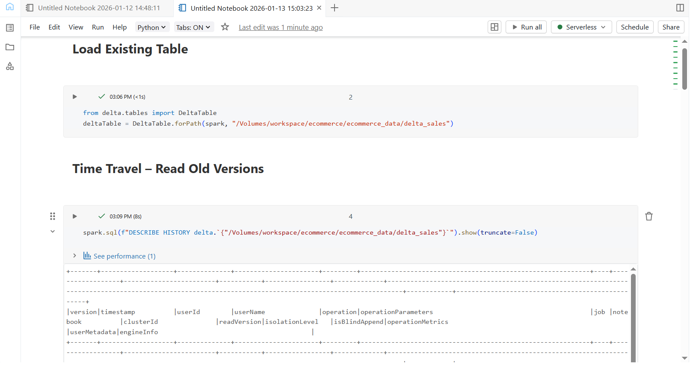
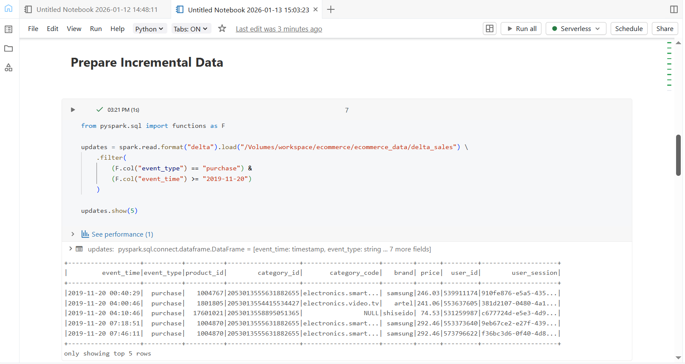
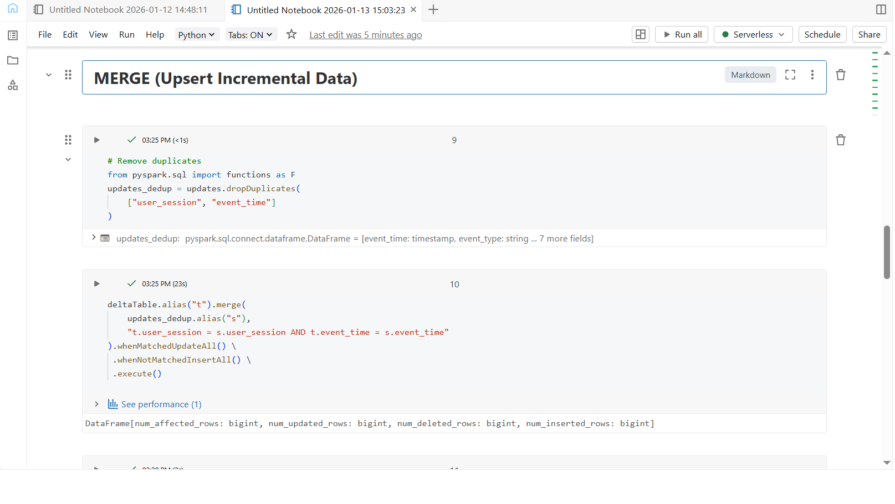
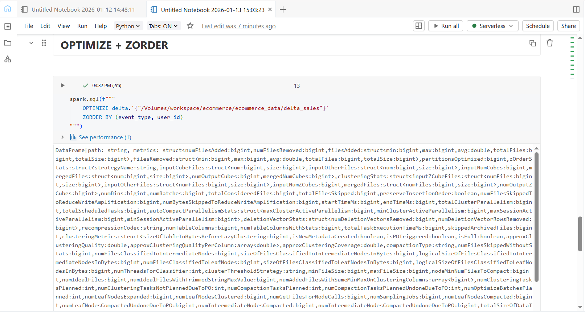
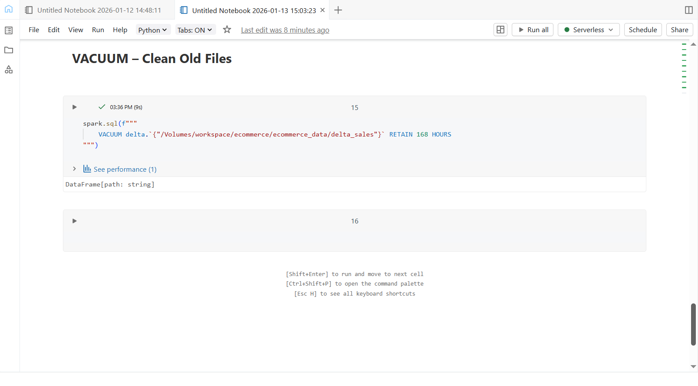

## Day 5 – Delta Lake Advanced Operations

### Learn
- Understanding Delta Lake versioning and time travel  
- Performing incremental data loads using MERGE (upserts)  
- Optimizing Delta tables for query performance  
- Cleaning up unused files using VACUUM  
- Handling duplicate records during MERGE operations  

---

### Tasks
- Loaded existing Delta table created on previous day  
- Prepared incremental purchase data from e-commerce dataset  
- Removed duplicate records to avoid MERGE conflicts  
- Performed MERGE to update and insert incremental data  
- Queried Delta table history using time travel  
- Optimized Delta table using OPTIMIZE and ZORDER  
- Cleaned old unused files using VACUUM  

---

### Practice
- Loaded Delta tables using `DeltaTable.forPath()`  
- Filtered incremental data using conditions on event type and date  
- Applied `dropDuplicates()` to handle multiple source matches  
- Used MERGE for upsert logic (update + insert)  
- Used `DESCRIBE HISTORY` to view table versioning  
- Applied `OPTIMIZE` with `ZORDER BY` for performance tuning  
- Executed `VACUUM` to manage storage efficiently  

---

### Output Screenshots

**Time Travel – Version History**  

**Prepare Incremental Data**  

**MERGE (Upsert Incremental Data)**  

**OPTIMIZE + ZORDER**  

**VACUUM – Clean Old Files**  

---

### Key Takeaway
Delta Lake enables reliable data engineering workflows by supporting incremental updates, historical data access, performance optimization, and safe cleanup — making it ideal for production-grade data pipelines.

---

### Acknowledgement
This work is part of the **Databricks 14 Days AI Challenge**,  
organised by [Indian Data Club](https://indiandataclub.com/) and  
[Codebasics](https://codebasics.io/),  
and sponsored by [Databricks](https://www.databricks.com/).

**#DatabricksWithIDC**
