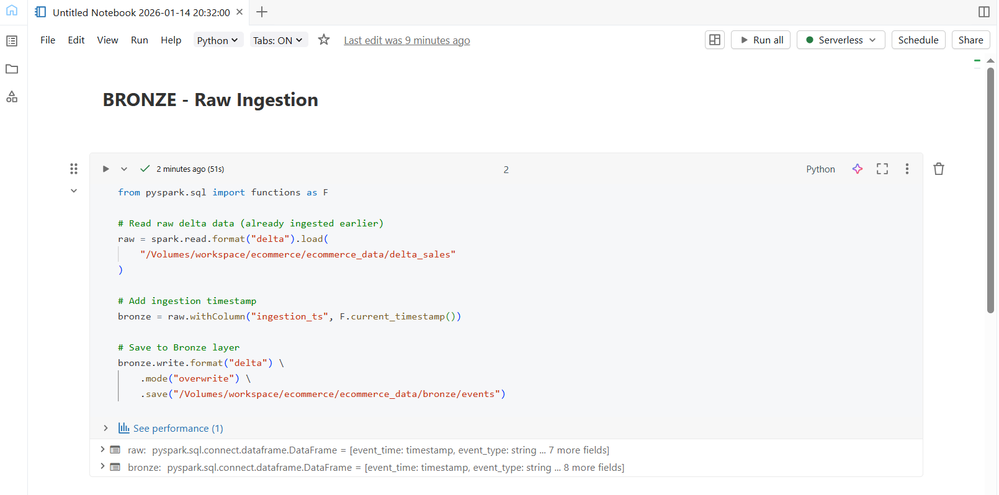
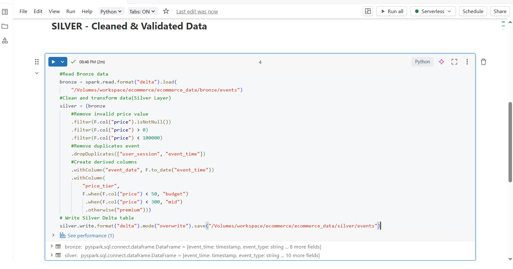
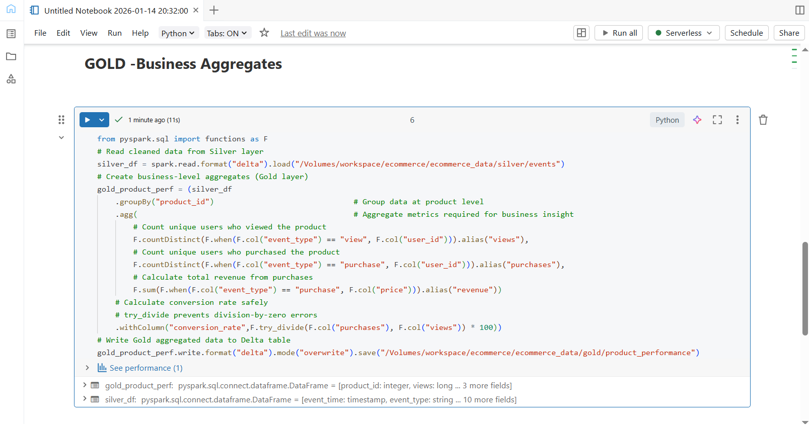

## Day 6 – Medallion Architecture (Bronze, Silver & Gold)

### Learn
- Understanding Medallion Architecture (Bronze, Silver, Gold layers)  
- Role of each layer in modern data platforms  
- How Delta Lake supports layered data processing  
- Best practices for raw ingestion, data cleaning, and business aggregates  
- Importance of data quality and separation of concerns  

---

### Tasks
- Designed a 3-layer Medallion Architecture  
- Built **Bronze layer** for raw data ingestion  
- Built **Silver layer** for cleaned and validated data  
- Built **Gold layer** for business-level aggregations  
- Stored each layer as Delta tables using Databricks Volumes  

---

### Practice
- Loaded raw Delta data and added ingestion timestamp (Bronze)  
- Read Bronze data and applied cleaning rules (Silver)  
- Removed invalid price values and duplicate events  
- Created derived columns like event date and price tier  
- Generated product-level business metrics (Gold)  
- Safely calculated conversion rate using `try_divide`  
- Persisted all layers as Delta tables  

---

### Output Screenshots

**Bronze – Raw Ingestion**  

**Silver – Cleaned & Validated Data**  

**Gold – Business Aggregates**  

---

### Key Takeaway
Medallion Architecture helps build scalable and maintainable data pipelines by clearly separating raw data, cleaned data, and business-ready aggregates. Using Delta Lake with Bronze, Silver, and Gold layers ensures data reliability, quality, and performance in real-world analytics systems.

---

### Acknowledgement
This work is part of the **Databricks 14 Days AI Challenge**,  
organised by [Indian Data Club](https://indiandataclub.com/) and  
[Codebasics](https://codebasics.io/),  
and sponsored by [Databricks](https://www.databricks.com/).

**#DatabricksWithIDC**
