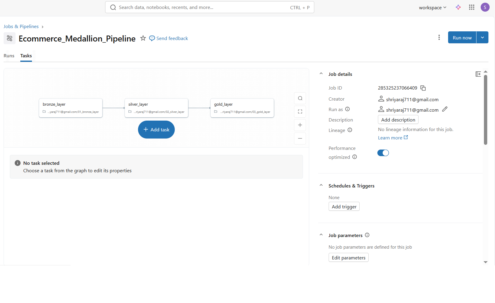
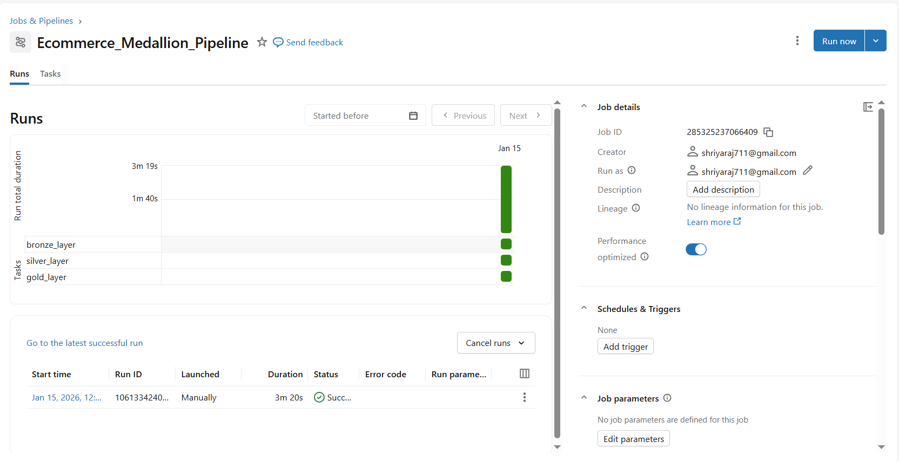

## DAY 7  Workflows & Job Orchestration

### Learn
- Difference between Databricks Jobs and interactive notebooks
- Creating multi-task workflows in Databricks
- Using parameters with Databricks widgets
- Scheduling and orchestrating end-to-end data pipelines
- Basic understanding of error handling in job workflows

---

### 🛠️ Tasks
1. Added parameter widgets to Bronze, Silver, and Gold notebooks
2. Created a multi-task Databricks Job for Medallion Architecture
3. Configured task dependencies:
   - Silver runs after Bronze
   - Gold runs after Silver
4. Executed the workflow using Databricks Jobs
5. Observed job runs and task execution status

---

### Practice
- Used `dbutils.widgets` to pass parameters between notebooks
- Orchestrated Bronze → Silver → Gold layers using a single job
- Executed end-to-end pipeline with one click
- Monitored task-level execution and success status

---

### Output Screenshots

**Job Workflow Configuration**  

**Multi-Task Job Execution (Bronze → Silver → Gold)**  

---

### Key Takeaway
Databricks Jobs enable production-ready workflows by orchestrating multiple notebooks with dependencies, parameters, and scheduling. This approach helps automate data pipelines and ensures reliable execution of Medallion Architecture layers.

---

### Acknowledgement
This work is part of the **Databricks 14 Days AI Challenge**,  
organised by [Indian Data Club](https://indiandataclub.com/) and  
[Codebasics](https://codebasics.io/),  
and sponsored by [Databricks](https://www.databricks.com/).

**#DatabricksWithIDC**
