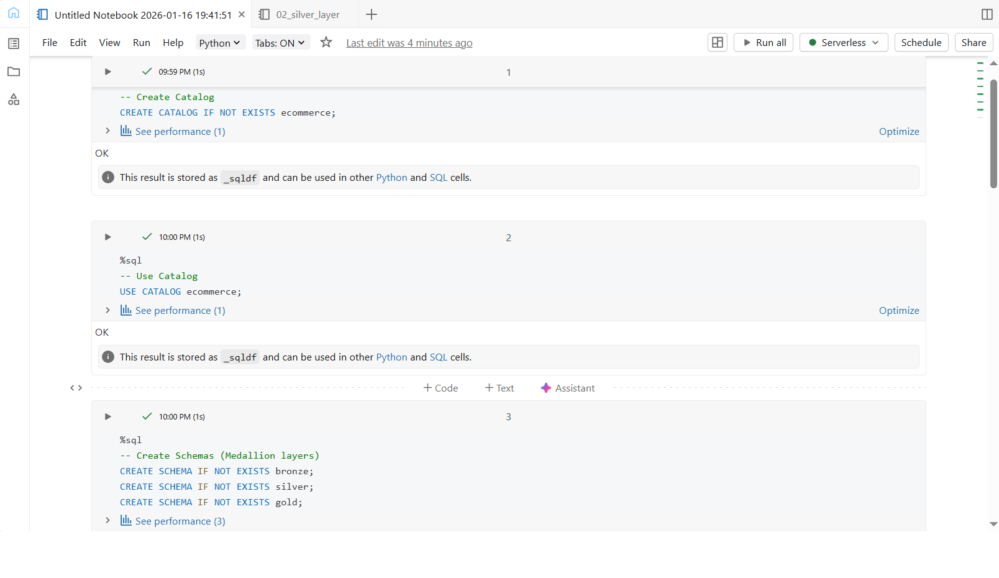
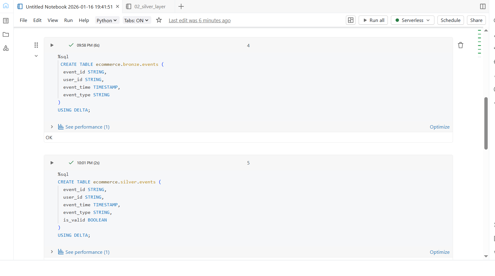
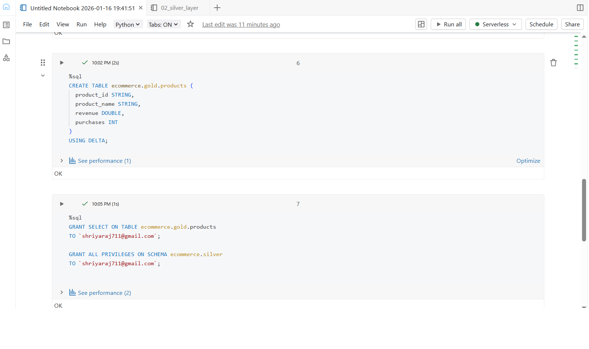

## DAY 8  – Unity Catalog Governance

### Learn
- Unity Catalog hierarchy: Catalog → Schema → Table  
- Difference between managed tables and external tables  
- Registering Delta tables in Unity Catalog  
- Access control using GRANT and REVOKE  
- Schema-level and table-level permissions  
- Creating views for controlled data access  

---

### 🛠️ Tasks
1. Created a Unity Catalog for the ecommerce project  
2. Created Bronze, Silver, and Gold schemas  
3. Registered Delta tables in each Medallion layer  
4. Applied access permissions using GRANT statements  
5. Verified tables and permissions using Catalog Explorer  

---

### Practice
- Implemented Catalog → Schema → Table structure  
- Created managed Delta tables in Bronze, Silver, and Gold layers  
- Applied SELECT and ALL PRIVILEGES permissions on tables and schemas  
- Created a view in the Gold layer for controlled data consumption  

---

### Output Screenshots

**Catalog & Schema Structure**  

**Registered Delta Tables**  

**Permissions & Governance Setup**  

---

### Key Takeaway
Unity Catalog enables centralized governance in Databricks by managing data security, access control, and data organization across the Medallion Architecture. It ensures secure, scalable, and compliant data management.

---

### Acknowledgement
This work is part of the **Databricks 14 Days AI Challenge**,  
organised by [Indian Data Club](https://indiandataclub.com/) and  
[Codebasics](https://codebasics.io/),  
and sponsored by [Databricks](https://www.databricks.com/).

**#DatabricksWithIDC**
