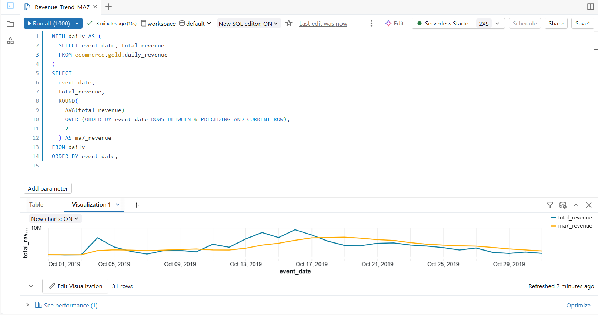
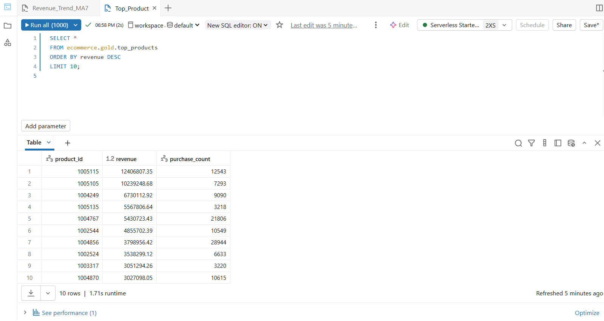
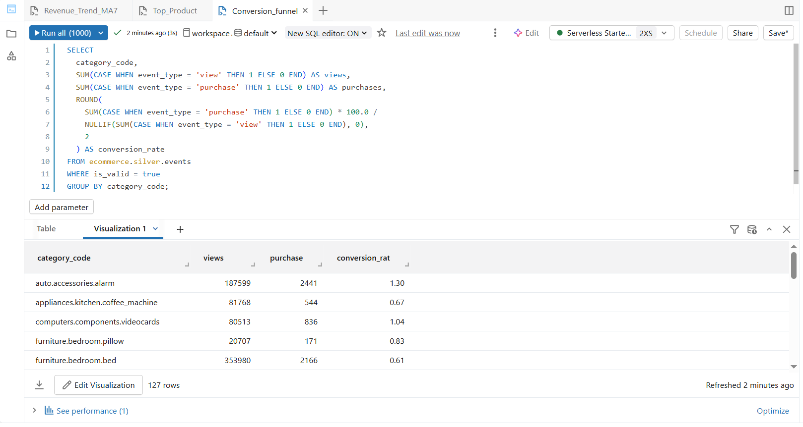
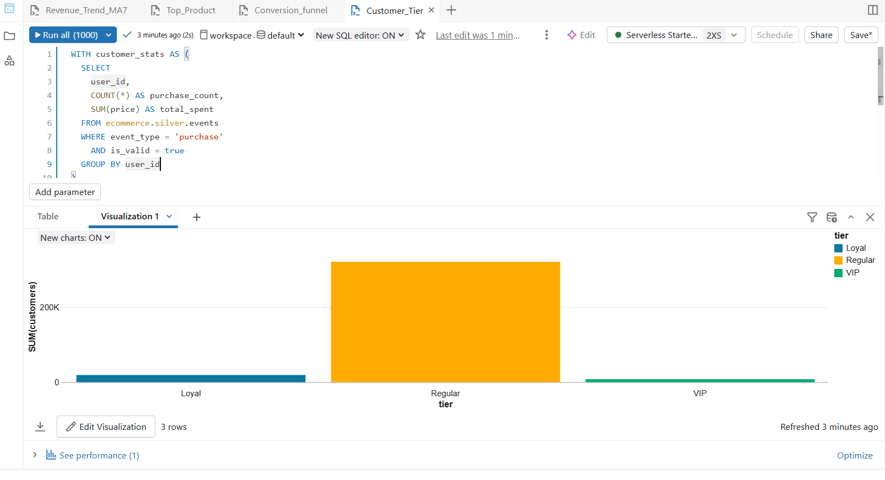

### Day 9 – SQL Analytics & Dashboards (Databricks)

### Learn
- SQL warehouses
- Complex analytical queries
- Dashboard creation
- Visualizations & filters
  
---

### Tasks
- Create SQL warehouse
- Write analytical queries
- Build dashboard: revenue trends, funnels, top products
- Add filters & schedule refresh
  
---

### Practice

- Calculated daily revenue with a 7-day moving average using window functions
- Identified top products based on revenue and purchases
- Built a conversion funnel by category
- Classified customers into VIP, Loyal, and Regular tiers
- Used aggregation, CASE statements, and subqueries
- Validated query outputs using Databricks SQL Editor

---

### Output Screenshots

**Revenue Trend with 7-Day Moving Average**  

**Top Products Analysis**  

**Conversion Funnel by Category**  

**Customer Tier Segmentation**  

---

### Key Takeaway

SQL analytics enables powerful business insights by transforming raw data into meaningful trends, funnels, and customer segments. Using Databricks SQL with window functions and aggregations makes it easier to analyze large-scale data and prepare it for dashboards and decision-making.

---

### Acknowledgement
This work is part of the **Databricks 14 Days AI Challenge**,  
organised by [Indian Data Club](https://indiandataclub.com/) and  
[Codebasics](https://codebasics.io/),  
and sponsored by [Databricks](https://www.databricks.com/).

**#DatabricksWithIDC**

.

#DatabricksWithIDC
