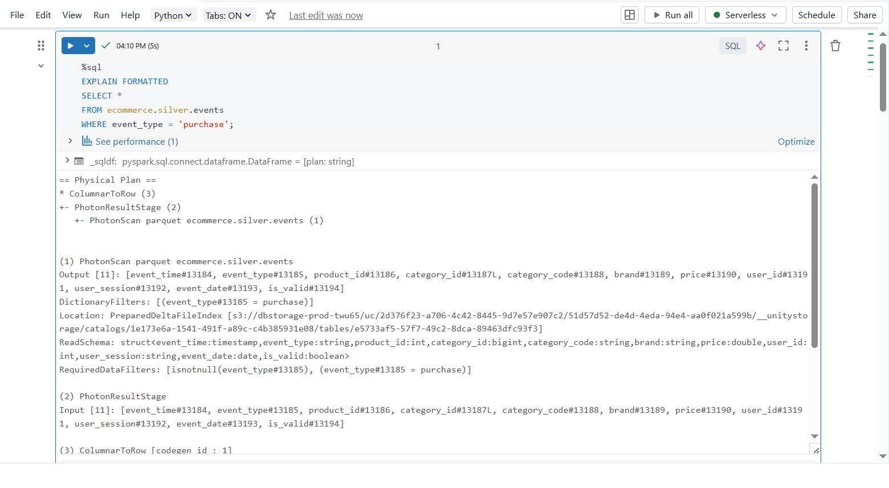
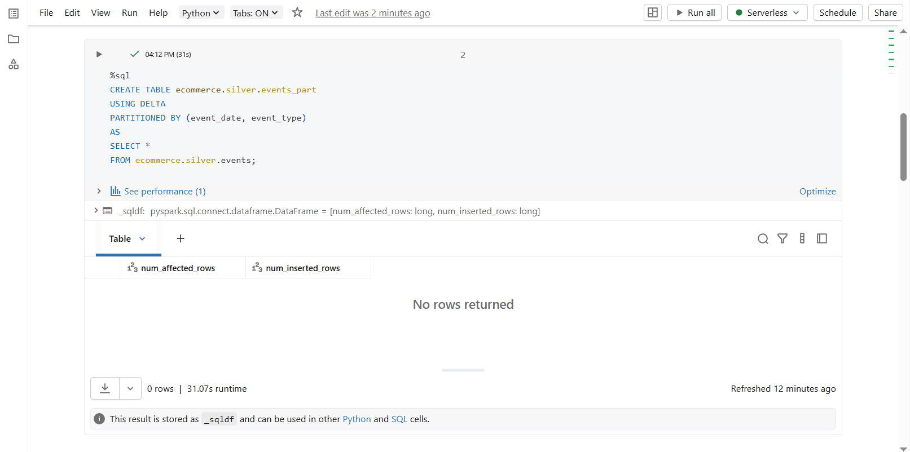
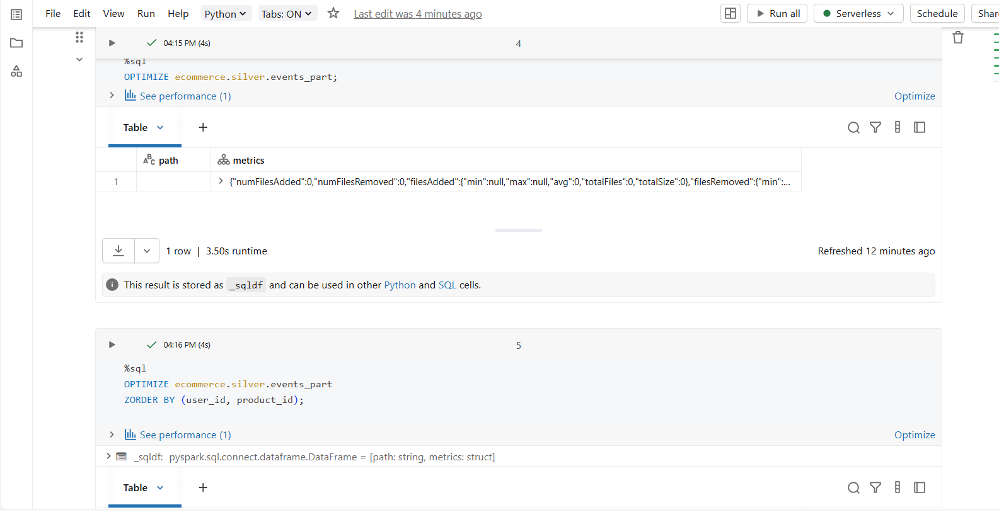
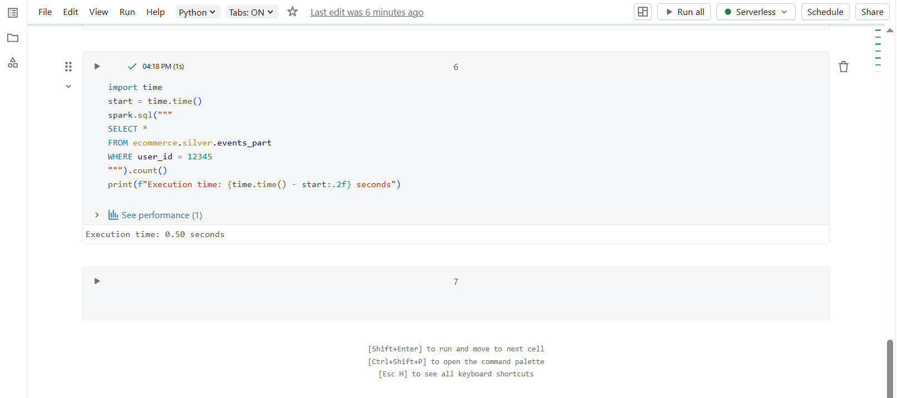

## DAY 10  – Performance Optimization (Databricks)

---

### Learn

- Understanding query execution plans using `EXPLAIN FORMATTED`
- Table partitioning strategies for large datasets
- Performance optimization using `OPTIMIZE`
- Data skipping with `ZORDER`
- Measuring and comparing query execution time

---

### 🛠️ Tasks

1. Analyzed query execution plans using `EXPLAIN FORMATTED`
2. Created a partitioned Silver table using `event_date` and `event_type`
3. Applied `OPTIMIZE` on Delta tables
4. Used `ZORDER BY` to improve query performance on frequently filtered columns
5. Benchmarked query execution time before and after optimization

---

### 📝 Practice

- Executed `EXPLAIN FORMATTED` to understand how Databricks scans and filters data
- Created a partitioned Delta table for Silver layer to reduce data scan
- Optimized Delta tables using `OPTIMIZE`
- Applied `ZORDER BY (user_id, product_id)` for faster selective queries
- Measured query execution time using Python timing logic
- Verified performance improvements through reduced execution time

---

### Output Screenshots

**Query Execution Plan Analysis**

**Partitioned Silver Table**

**OPTIMIZE & ZORDER Execution**

**Performance Benchmark Result**

---

### Key Takeaway

Performance optimization is critical for large-scale data processing.  
Using partitioning, OPTIMIZE, and ZORDER significantly improves query efficiency by reducing data scans and execution time.  
Analyzing query plans helps in making informed optimization decisions in Databricks.

---

### Acknowledgement

This work is part of the **Databricks 14 Days AI Challenge**,  
organised by [Indian Data Club](https://indiandataclub.com/) and  
[Codebasics](https://codebasics.io/),  
and sponsored by [Databricks](https://www.databricks.com/).

**#DatabricksWithIDC**
