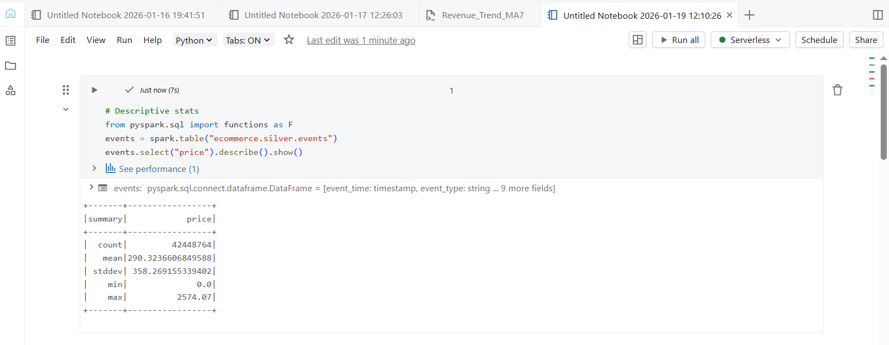
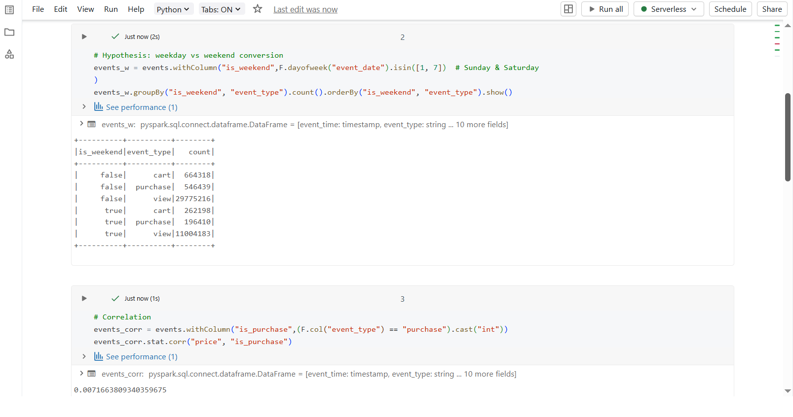
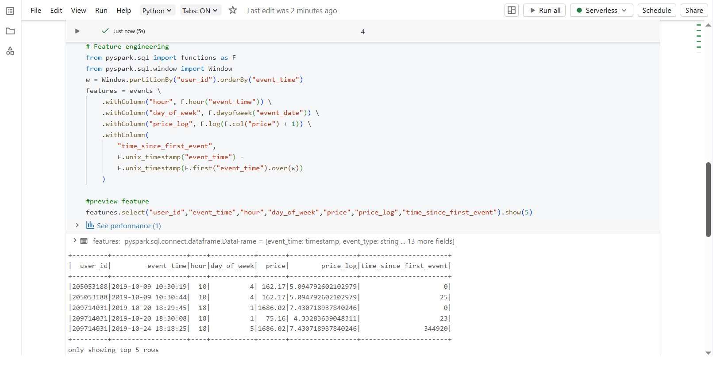

## DAY 11 – Statistical Analysis & ML Prep (Databricks)

---

### Learn

- Descriptive statistics using PySpark
- Hypothesis testing (weekday vs weekend behavior)
- Correlation analysis
- Feature engineering for machine learning

---

### 🛠️ Tasks

1. Calculated statistical summaries on event data
2. Tested weekday vs weekend user behavior
3. Identified correlation between price and purchases
4. Engineered features for ML readiness

---

### 📝 Practice

- Used `describe()` to compute count, mean, standard deviation, min, and max values
- Created `is_weekend` flag to compare weekday and weekend events
- Grouped event types (view, cart, purchase) to validate behavioral differences
- Created binary `is_purchase` feature and calculated correlation with price
- Engineered features such as hour, day of week, log-transformed price, and time since first event
- Used window functions to capture user-level behavior over time

---

### Output Screenshots

**Descriptive Statistics**

**Hypothesis Testing & Correlation Analysis**

**Feature Engineering**

---

### Key Takeaway

Statistical analysis helps validate assumptions and understand data behavior before applying machine learning.  
Feature engineering plays a crucial role in transforming raw events into meaningful inputs for predictive models.  
PySpark enables scalable statistical analysis on large datasets in Databricks.

---

### Acknowledgement

This work is part of the **Databricks 14 Days AI Challenge**,  
organised by [Indian Data Club](https://indiandataclub.com/) and  
[Codebasics](https://codebasics.io/),  
and sponsored by [Databricks](https://www.databricks.com/).

**#DatabricksWithIDC**
