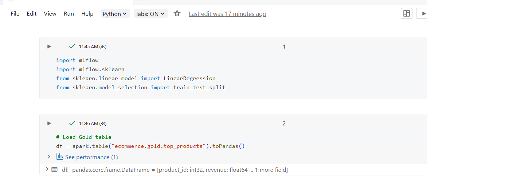
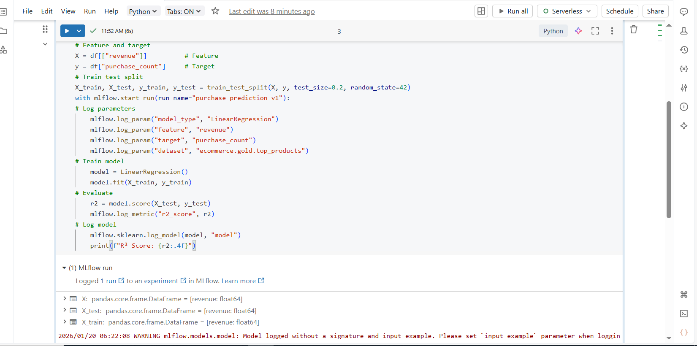

## DAY 12 – MLflow Model Training & Experiment Tracking (Databricks)

---

### Learn

- Introduction to MLflow and experiment tracking
- Training machine learning models in Databricks
- Logging parameters, metrics, and artifacts using MLflow
- Managing multiple experiment runs
- Understanding model performance through tracked metrics

---

### 🛠️ Tasks

1. Trained a machine learning model using Databricks
2. Created an MLflow experiment
3. Logged model parameters and evaluation metrics
4. Tracked multiple experiment runs
5. Reviewed experiment results using MLflow UI

---

### 📝 Practice

- Implemented model training code with MLflow integration
- Logged parameters such as learning rate and model settings
- Recorded evaluation metrics like accuracy and loss
- Stored trained model as an MLflow artifact
- Compared different runs to analyze model performance
- Used MLflow experiment UI to monitor and manage runs

---

### Output Screenshots

**MLflow Model Training Code**

**MLflow Experiment Runs**

---

### Key Takeaway

MLflow simplifies the machine learning lifecycle by enabling systematic experiment tracking.  
By logging parameters, metrics, and models, it becomes easier to compare experiments, improve model performance, and ensure reproducibility in Databricks-based ML workflows.

---

### Acknowledgement

This work is part of the **Databricks 14 Days AI Challenge**,  
organised by [Indian Data Club](https://indiandataclub.com/) and  
[Codebasics](https://codebasics.io/),  
and sponsored by [Databricks](https://www.databricks.com/).

**#DatabricksWithIDC**
