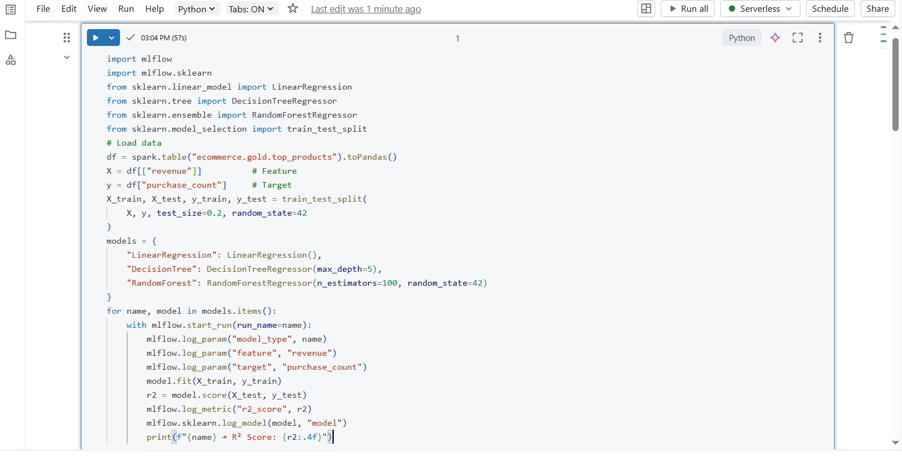
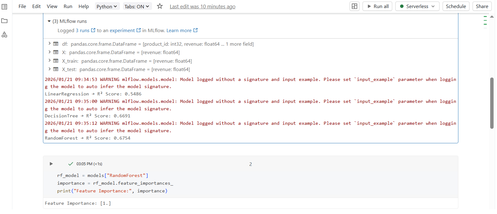
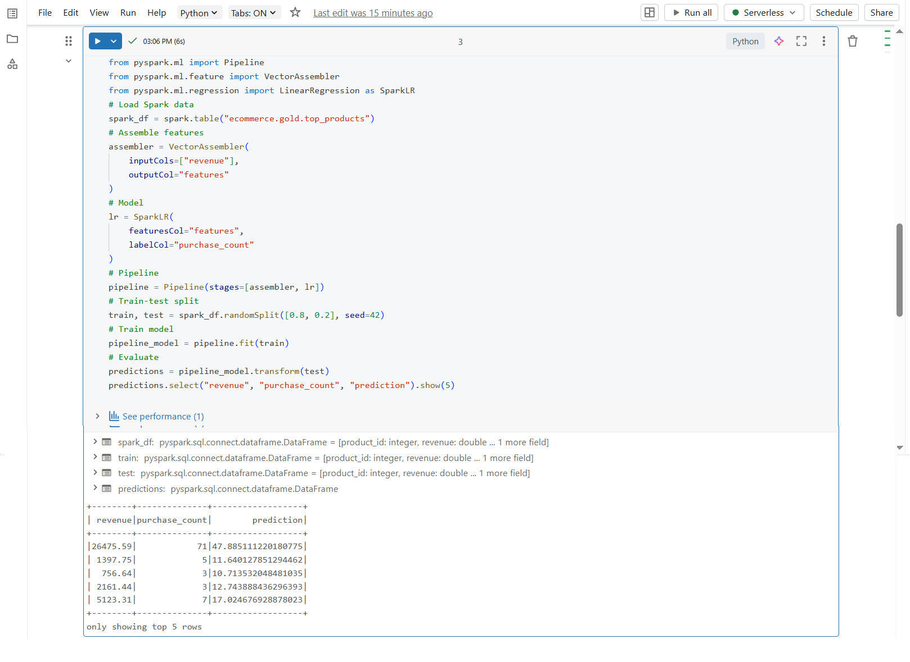

## DAY 13 – Model Comparison & Feature Engineering (Databricks)

---

### Learn

- Training multiple machine learning models
- Comparing model performance using MLflow
- Feature engineering techniques
- Understanding feature importance
- Building Spark ML pipelines

---

### 🛠️ Tasks

1. Trained multiple machine learning models
2. Logged model parameters and metrics in MLflow
3. Compared model performance across runs
4. Performed feature engineering
5. Built a Spark ML pipeline
6. Selected the best-performing model

---

### 📝 Practice

- Trained multiple models:
  - Linear Regression
  - Decision Tree Regressor
  - Random Forest Regressor
- Logged parameters, metrics, and models using MLflow
- Compared R² scores across different models
- Applied feature engineering techniques
- Extracted feature importance from tree-based models
- Built and executed a Spark ML pipeline
- Selected the best model based on evaluation metrics

---

### Output Screenshots

**Train & Compare Multiple Models (MLflow)**  

**Feature Importance (Tree-based Models)**  

**Spark ML Pipeline**  

---

### Key Takeaway

Comparing multiple models helps identify the most effective solution for a given problem.  
Feature engineering and MLflow-based experiment tracking improve model performance, reproducibility, and decision-making in Databricks machine learning workflows.

---

### Acknowledgement

This work is part of the **Databricks 14 Days AI Challenge**,  
organised by [Indian Data Club](https://indiandataclub.com/) and  
[Codebasics](https://codebasics.io/),  
and sponsored by [Databricks](https://www.databricks.com/).

**#DatabricksWithIDC**
