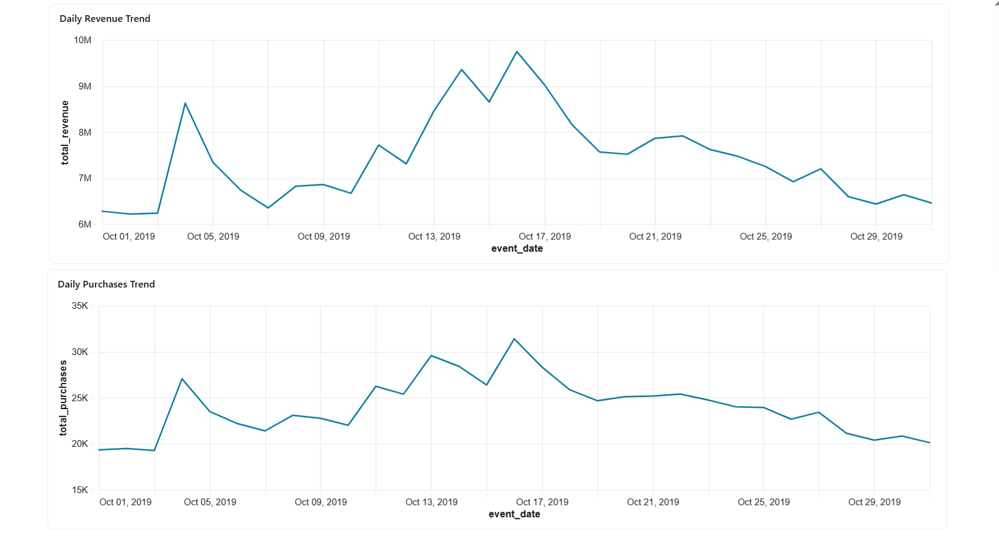
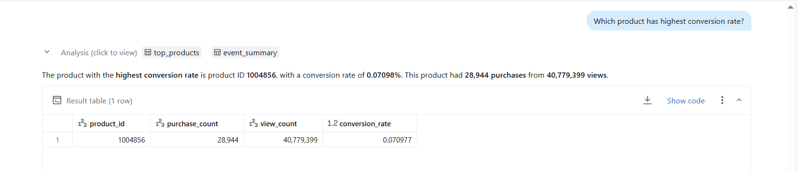
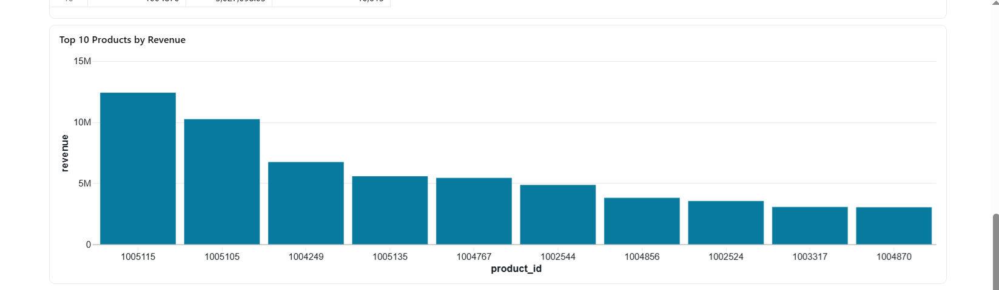

## DAY 14 – AI-Powered Analytics with Genie & Mosaic AI (Databricks)

---

### Learn

- Databricks Genie for natural language to SQL queries
- AI-assisted data analysis using Mosaic AI
- Generative AI for business insights
- Interactive analytics using conversational queries

---

### 🛠️ Tasks

1. Queried datasets using natural language with Databricks Genie
2. Analyzed daily revenue and purchase trends
3. Identified top-performing products by revenue
4. Calculated product conversion rates
5. Generated AI-powered insights using Mosaic AI

---

### 📝 Practice

- Used Genie to convert natural language questions into SQL queries
- Analyzed daily revenue trends over time
- Examined daily purchase patterns
- Identified the product with the highest conversion rate
- Visualized top 10 products by total revenue
- Leveraged AI-assisted explanations to interpret results quickly

---

### Output Screenshots

**Daily Revenue & Purchase Trend**

**Highest Conversion Rate Analysis**

**Top 10 Products by Revenue**

---

### Key Takeaway

AI-powered analytics significantly reduces the gap between business questions and data insights.  
With Databricks Genie and Mosaic AI, users can analyze data using natural language, gain faster insights, and make informed decisions without writing complex SQL queries.

---

### Acknowledgement

This work is part of the **Databricks 14 Days AI Challenge**,  
organised by [Indian Data Club](https://indiandataclub.com/) and  
[Codebasics](https://codebasics.io/),  
and sponsored by [Databricks](https://www.databricks.com/).

**#DatabricksWithIDC**
